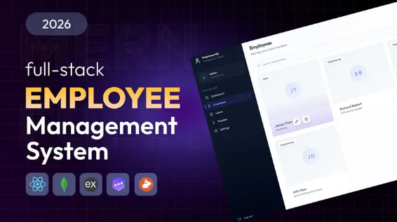
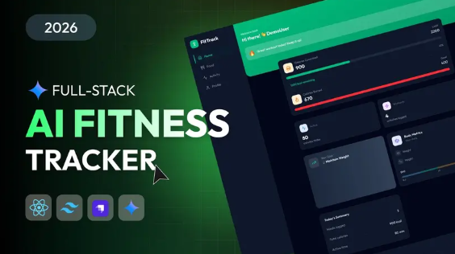
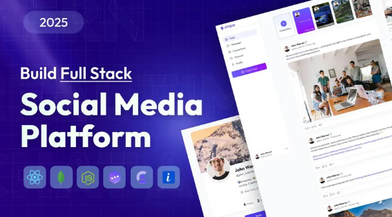

## Full-stack Employee Management System
Streamline your workforce operations, track attendance, manage payroll, and empower your team securely.
- 
- Tags: Category 1
- Badges:
  - React [blue]
  - Node [blue]
- Buttons:
  - Link [https://ems-gs.vercel.app]

## Full-stack AI Fitness Tracker App 
Elevate your fitness journey with intelligent coaching, track workouts and nutrition, monitor progress in real time, and achieve your goals with personalized AI-driven insights.
- 
- Tags: Category 2
- Badges:
  - Java [blue]
- Buttons:
  - Link [https://fitness-gs.vercel.app]

## Full-stack Social Media App
Connect with your community, share moments instantly, discover trending content, and build meaningful relationships through a secure and engaging social experience.
- 
- Tags: Category 3
- Badges:
  - GO [blue]
  - Express [blue]
- Buttons:
  - Link [https://pingup-gs.vercel.app]